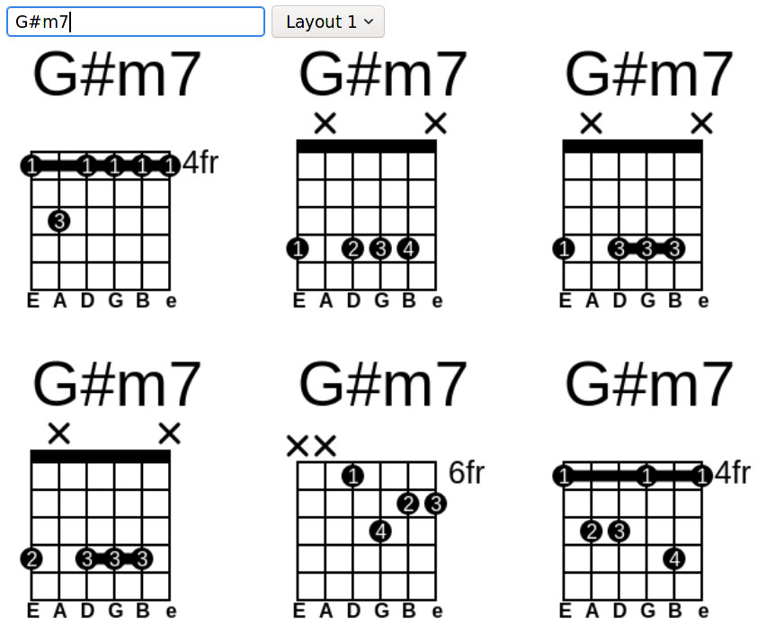

This project utilizes a huge library of guitar chords and an improved version of ChordJS to render beautiful and easy to understand chord diagrams for any chord you want.  

## Take a look at it here 
[Chord-Draw online](https://t-vk.github.io/Chord-Draw/)

## Screenshot:

## License
The source is licensed under the GPL.
